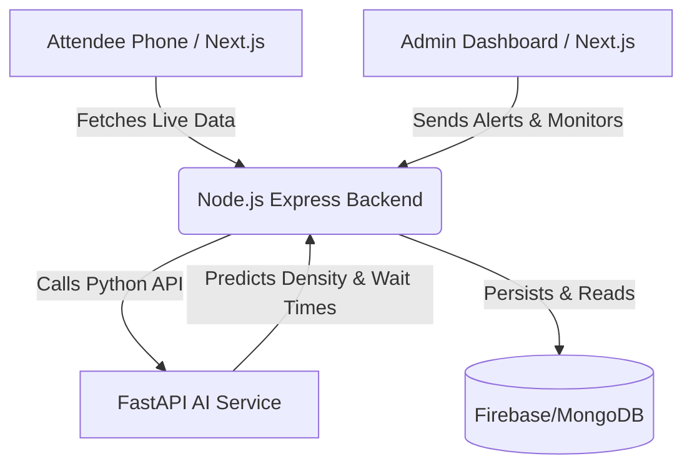

# 🏟️ SmartCrowd AI: Intelligent Venue Experience Optimization

A comprehensive, production-ready full-stack AI system designed to solve physical event congestion, optimize queue times, and provide real-time coordination for large-scale sporting venues.

## 🚀 Key Features
- **AI Crowd Management System:** Predicts crowd density and visualizes heatmaps in real-time.
- **Smart Queue Prediction:** Machine Learning model estimating wait times at food stalls, restrooms, and gates.
- **Dynamic Routing:** Suggests the fastest paths avoiding congested zones.
- **Live Admin Alerts:** Centralized dashboard for venue administrators to trigger emergency or directional alerts via WebSockets/Polling.
- **Premium User Experience:** Stunning UI with Next.js, Glassmorphism, and micro-animations.

## 🏗️ Architecture



## 🛠️ Tech Stack
- **Frontend:** Next.js (App Router), React, Custom Vanilla CSS (Premium Glassmorphism).
- **Backend:** Node.js, Express.js.
- **AI / ML Service:** Python, FastAPI, NumPy, Scikit-learn (Simulated for Hackathon).
- **Containerization:** Docker (Ready for Cloud Run).

## 💻 Running Locally

### 1. AI Service (Python)
```bash
cd ai-service
python -m venv venv
# Windows: venv\Scripts\activate | Mac/Linux: source venv/bin/activate
pip install -r requirements.txt
uvicorn main:app --reload --port 8000
```
*API will run at http://localhost:8000*

### 2. Core Backend (Node.js)
```bash
cd backend
npm install
npm start
```
*Server will run at http://localhost:5000*

### 3. Frontend Web App (Next.js)
```bash
cd frontend
npm install
npm run dev
```
*App will run at http://localhost:3000*

## 🌐 Deployment Guide

### Deploying AI & Backend to Google Cloud Run
1. Ensure you have the `gcloud` CLI installed and authenticated.
2. Build and submit the AI Service:
   `gcloud run deploy smartcrowd-ai --source ./ai-service --platform managed --allow-unauthenticated`
3. Build and submit the Core Backend:
   `gcloud run deploy smartcrowd-backend --source ./backend --platform managed --allow-unauthenticated`

### Deploying Frontend to Vercel
1. Install Vercel CLI: `npm i -g vercel`
2. Navigate to frontend: `cd frontend`
3. Run `vercel` and follow the prompts.

## 🏆 Hackathon Notes
This system emphasizes UX aesthetics, scalable 3-tier architecture, and integration of AI concepts into a real-world city infrastructure problem.
